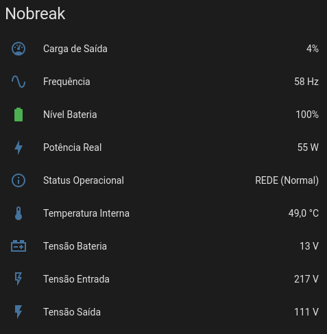

# Joule

Monitor de nobreak via USB que publica a telemetria no Home Assistant por MQTT e, quando a
energia não volta, desliga os servidores com segurança antes que a bateria acabe. Quando a energia
volta, o nobreak religa a saída e os servidores sobem sozinhos.

Foi escrito para uso doméstico, roda em container e não depende de nuvem nem de serviço externo.

## Aviso importante, leia antes de usar

Este projeto foi feito por **engenharia reversa** do protocolo serial do nobreak, observando os
bytes trocados na porta USB.

* Eu **nunca tive acesso** a documentação, especificação, SDK, firmware ou qualquer material
  técnico da Ragtech.
* Este projeto **não tem nenhum vínculo** com a Ragtech Eletrônica Industrial Ltda. Não é
  autorizado, homologado, patrocinado nem revisado por ela. "Ragtech", "Easy Pro" e "Supervise" são
  marcas de seus titulares e aparecem aqui apenas para indicar com qual equipamento o software foi
  testado e qual software ele substitui.
* Os valores de calibração, os bits de status e os comandos de desligamento foram **deduzidos por
  observação**. Eles funcionam no meu equipamento. Podem estar errados no seu, mesmo que o modelo
  pareça igual.

**Use por sua conta e risco.** Este software envia comandos que cortam a saída do nobreak e
desligam máquinas. Um comando interpretado de forma diferente pelo seu equipamento pode causar
desligamento inesperado, perda de dados, corrupção de sistemas de arquivos ou dano a hardware. O
autor não se responsabiliza por nada disso. O software é fornecido **sem qualquer garantia**, nos
termos da GPL-3.0 (veja a seção [Licença](#licença)).

Antes de confiar nele, teste com carga sem importância, acompanhe os logs e confirme que os
valores lidos batem com o que o painel do seu nobreak mostra.

## Uma alternativa ao Supervise 8

O software oficial da Ragtech para esta linha de nobreaks é o **Supervise 8**, distribuído só para
Windows e para Linux em pacote `.deb`. Não existe versão para **ARM** (Raspberry Pi e similares) nem
para **macOS**.

O Joule nasceu para cobrir essa lacuna. A imagem é publicada para `linux/amd64` e `linux/arm64`,
então roda tanto num servidor ou mini PC x86 quanto num Raspberry Pi. Além do desligamento
automático, ele entrega monitoramento contínuo e integração com o Home Assistant por MQTT, com os
sensores criados automaticamente.

Até agora ele **só foi testado em Linux, rodando em Docker**. Se você usar no macOS ou no Windows,
funcionando ou não, deixe seu feedback numa [issue](https://github.com/edwarddn/joule/issues). É
assim que a lista de plataformas suportadas cresce.

## Equipamento testado

| Fabricante | Modelo                 | Conexão   | Situação              |
| ---------- | ---------------------- | --------- | --------------------- |
| Ragtech    | 4162 Easy Pro NEP 1200 | USB (CDC) | Testado em uso diário |

Outros modelos da mesma linha **talvez** funcionem, porque provavelmente compartilham o protocolo.
Ninguém confirmou. Se você testar em outro modelo, abra uma issue contando o resultado, com ou sem
sucesso, e cole o pacote cru lido do equipamento. Para vê-lo, suba com log em debug:

```yaml
    environment:
      LOGGING_LEVEL_BR_COM_EDWARD_JOULE: DEBUG
```

Cada leitura passa a sair assim, e é isso que ajuda a mapear o protocolo:

```
| Pacote lido: AA 1E 00 80 ...
```

## O que ele faz

1. Abre a porta USB do nobreak, faz o handshake e passa a consultar o status em intervalo
   configurável.
2. Decodifica o pacote de 31 bytes e extrai tensão de entrada e saída, corrente, potência,
   frequência, tensão e carga da bateria, temperatura interna e os bits de status.
3. Publica o estado em um tópico MQTT retido e registra os sensores no Home Assistant por MQTT
   Discovery, sem precisar editar nenhum YAML do HA.
4. Se a rede elétrica cai e não volta dentro do limite configurado, arma o desligamento do nobreak
   **com religamento automático** e manda `poweroff` nos servidores cadastrados, via SSH. Quando a
   energia volta, o nobreak religa a saída sozinho.
5. Em situação crítica, bateria no fim ou temperatura acima do limite, desliga imediatamente e
   **sem** religamento automático.

Cada etapa é opcional. Dá para usar só a telemetria, só o desligamento, ou os dois.

## Entidades criadas no Home Assistant

Com o discovery ligado, aparece um dispositivo chamado "Nobreak" com estes sensores:



| Entidade                   | Descrição           | Unidade |
| -------------------------- | ------------------- | ------- |
| `sensor.nobreak_in_volt`   | Tensão de entrada   | V       |
| `sensor.nobreak_out_volt`  | Tensão de saída     | V       |
| `sensor.nobreak_power`     | Potência real       | W       |
| `sensor.nobreak_freq`      | Frequência          | Hz      |
| `sensor.nobreak_bat_volt`  | Tensão da bateria   | V       |
| `sensor.nobreak_bat_level` | Nível da bateria    | %       |
| `sensor.nobreak_temp`      | Temperatura interna | °C      |
| `sensor.nobreak_load`      | Carga de saída      | %       |
| `sensor.nobreak_status`    | Status operacional  | texto   |

O prefixo `nobreak` vem de `HA_DEVICE_ID` e pode ser trocado, útil se você tiver mais de um
equipamento.

## Pré-requisitos

* Um nobreak compatível ligado por USB na máquina que vai rodar o Joule.
* Docker e Docker Compose, em máquina `amd64` ou `arm64`. Para build local, Java 25 e Maven 4 (o
  wrapper `./mvnw` já resolve o Maven).
* Um broker MQTT, por exemplo Mosquitto, **somente se** você quiser a telemetria. Sem broker,
  basta desligar o MQTT.
* Servidores configurados para ligar sozinhos quando a energia volta, **somente se** você quiser
  o religamento automático. Veja [Religamento automático](#religamento-automático-quando-a-energia-volta).

A porta costuma aparecer como `/dev/ttyACM0`. Confirme com:

```bash
ls -l /dev/ttyACM* /dev/ttyUSB*
dmesg | grep -i tty
```

## Como rodar

### Docker Compose

A imagem publicada é `edwarddn/joule`. Este exemplo monitora o nobreak, publica no Home Assistant e
desliga dois servidores por SSH, o servidor de DNS com AdGuard Home
e o homelab onde o próprio Joule roda:

```yaml
services:
  joule:
    image: edwarddn/joule:latest
    container_name: joule
    restart: unless-stopped
    environment:
      TZ: America/Sao_Paulo
      JAVA_TOOL_OPTIONS: >-
        -Duser.language=pt -Duser.country=BR
        -Duser.timezone=America/Sao_Paulo -Dfile.encoding=UTF-8
        --enable-native-access=ALL-UNNAMED

      # MQTT
      MQTT_URL: ${MQTT_URL}
      MQTT_USER: ${MQTT_USER}
      MQTT_PASS: ${MQTT_PASS}

      # Configuração do nobreak
      NOBREAK_PORT: /dev/ttyACM0
      SHUTDOWN_STEPS: 2

      # Servidor 1: AdGuard, DNS da rede (índice 0)
      SSH_SERVERS_0_NAME: AdGuard
      SSH_SERVERS_0_HOST: 192.168.1.20
      SSH_SERVERS_0_PORT: 22
      SSH_SERVERS_0_USER: usuario
      SSH_SERVERS_0_PRIVATE_KEY_PATH: /keys/id_ed25519

      # Servidor 2: Homelab (índice 1), a máquina que hospeda o Joule, por isso vai por último
      SSH_SERVERS_1_NAME: Homelab
      SSH_SERVERS_1_HOST: 192.168.1.30
      SSH_SERVERS_1_PORT: 22
      SSH_SERVERS_1_USER: usuario
      SSH_SERVERS_1_PRIVATE_KEY_PATH: /keys/id_ed25519
    devices:
      - /dev/ttyACM0:/dev/ttyACM0
    volumes:
      - ./logs:/workspace/logs
      - /home/usuario/.ssh/id_ed25519:/keys/id_ed25519:ro
```

As credenciais do MQTT ficam num `.env` ao lado do `docker-compose.yml`, fora do versionamento:

```bash
MQTT_URL=tcp://192.168.1.10:1883
MQTT_USER=usuario_mqtt
MQTT_PASS=senha_mqtt
```

O MQTT funciona com ou sem criptografia, e quem decide é o esquema da URL:

```bash
# Sem criptografia, em texto puro (porta padrão 1883)
MQTT_URL=tcp://192.168.1.10:1883

# Com TLS (porta padrão 8883)
MQTT_URL=ssl://mqtt.minhacasa.com.br:8883
```

Com `ssl://`, o certificado do broker é validado pela cadeia de confiança padrão do Java, então um
certificado de autoridade pública, como o do Let's Encrypt, funciona sem configuração extra. Sem
TLS, usuário e senha trafegam em texto puro, então prefira `ssl://` se o broker estiver fora da sua
rede local.

Com `SHUTDOWN_STEPS: 2` e o intervalo padrão de 30 segundos, o desligamento começa depois de cerca
de 1 minuto sem energia.

Suba com `docker compose up -d` e acompanhe com `docker compose logs -f joule`.

O arquivo [`docker-compose.yml`](docker-compose.yml) deste repositório traz outro exemplo, com
Mosquitto junto, e o [`.env.example`](.env.example) lista todas as variáveis com comentários.

### Sem Home Assistant e sem broker MQTT

Se você quer apenas o desligamento automático dos servidores e não usa Home Assistant, desligue o
MQTT. A aplicação não tenta se conectar a broker nenhum e a telemetria vai para o log da aplicação.

```yaml
    environment:
      MQTT_ENABLED: "false"
```

Se você usa MQTT com outro consumidor, mas não usa Home Assistant, mantenha o MQTT ligado e desligue
só o discovery. O estado continua sendo publicado em `joule/nobreak/status`.

```yaml
    environment:
      HA_DISCOVERY_ENABLED: "false"
```

### Sem desligar servidor nenhum

É o comportamento padrão. Enquanto você não cadastrar nenhum servidor em `SSH_SERVERS_*`, o Joule
só monitora, publica a telemetria e, na falta de energia prolongada, arma o desligamento do próprio
nobreak. Nenhuma máquina recebe comando.

Para não desligar nem o nobreak, desative o desligamento automático:

```yaml
    environment:
      SHUTDOWN_ENABLED: "false"
```

Isso vale para todos os gatilhos, inclusive a temperatura crítica e o status crítico. O Joule continua
monitorando e publicando a telemetria, e registra no log quando teria desligado.

### Desligando servidores por SSH

Cada servidor é um bloco numerado a partir de zero, como no exemplo acima. A ordem importa: os
servidores são desligados na ordem em que aparecem, então **deixe por último a máquina que hospeda
o Joule**, senão ela cai antes de mandar o comando nas outras.

A chave privada entra no container como volume somente leitura, e o caminho em
`SSH_SERVERS_<n>_PRIVATE_KEY_PATH` é o de **dentro** do container (`/keys/id_ed25519` no exemplo).

Em cada servidor de destino, o usuário precisa poder desligar sem senha. Crie o arquivo
`/etc/sudoers.d/joule` com:

```
usuario ALL=(ALL) NOPASSWD: /sbin/poweroff
```

Valide com `sudo visudo -c` e teste manualmente antes de contar com isso:

```bash
ssh -i ~/.ssh/id_ed25519 usuario@192.168.1.20 'sudo -n poweroff --help'
```

Se um servidor falhar, o erro é registrado no log e os demais continuam sendo desligados.

A verificação de host key está desativada, porque em um desligamento de emergência não há como
tratar chave desconhecida. Use isso apenas em rede que você controla.

## Religamento automático quando a energia volta

No desligamento por falta de energia prolongada, o Joule arma o nobreak no modo **desliga e
religa**:

1. Manda `poweroff` nos servidores.
2. Depois de `SHUTDOWN_DELAY` segundos, o nobreak corta a saída.
3. Quando a rede elétrica volta, o nobreak religa a saída sozinho.

O nobreak só devolve a energia. Quem decide se o servidor liga é o próprio servidor, e a maioria
dos PCs, por padrão, fica desligada quando a energia volta. Por isso é preciso configurar cada
máquina para ligar ao receber energia.

### Configurando a BIOS/UEFI

Entre na BIOS (em geral `Del`, `F2` ou `F7` na inicialização) e procure a opção de comportamento
após queda de energia. O nome muda conforme o fabricante:

| Nome da opção                       | Valor que liga a máquina |
| ----------------------------------- | ------------------------ |
| Restore on AC Power Loss            | Power On                 |
| AC Power Recovery / AC Back         | Power On / Always On     |
| After Power Failure                 | Power On                 |
| Power On After Power Fail           | On                       |
| State After G3                      | S0 State                 |

Costuma ficar em menus como Advanced, Power, Power Management, APM ou Chipset. Em mini PCs com
BIOS AMI Aptio é comum aparecer como **State After G3**, dentro de Chipset.

**Armadilha:** não use **Last State** (ou "Memória", "Previous State"). O servidor foi desligado
por `poweroff` antes do corte, então o último estado dele é desligado e ele não vai ligar.

### Raspberry Pi

Não precisa configurar nada. O Raspberry Pi não tem BIOS e liga sozinho sempre que recebe
energia.

### Testando

Com a máquina desligada por `sudo poweroff`, tire da tomada, espere alguns segundos e ligue de
novo. Ela deve ligar sozinha. Dá para testar direto na tomada, sem envolver o nobreak.

### Quando o religamento não acontece

Em situação crítica (bateria no fim, temperatura acima de `CRITICAL_TEMPERATURE` ou status
crítico), o Joule desliga **sem** religamento automático, porque não é seguro voltar a ligar com o
nobreak nesse estado. Depois de resolver o problema, ligue o nobreak manualmente pelo botão.

## Variáveis de ambiente

### Nobreak

| Variável                   | Padrão         | Descrição                                                                       |
| -------------------------- | -------------- | ------------------------------------------------------------------------------- |
| `NOBREAK_PORT`             | `/dev/ttyACM0` | Porta serial do nobreak dentro do container. Vazio desliga o monitoramento.     |
| `MONITOR_INTERVAL_SECONDS` | `30`           | Intervalo entre leituras de status.                                             |
| `SHUTDOWN_ENABLED`         | `true`         | `false` desativa todo desligamento automático, inclusive os de emergência.      |
| `SHUTDOWN_STEPS`           | `3`            | Quantas leituras seguidas em bateria antes de iniciar o desligamento. Mínimo 1. |
| `SHUTDOWN_DELAY`           | `60`           | Segundos entre o comando e o corte da saída do nobreak. Faixa aceita: 1 a 90.   |
| `CRITICAL_TEMPERATURE`     | `90`           | Acima disso o desligamento é imediato e sem religamento automático.             |

Com os padrões, a energia precisa ficar fora por cerca de 90 segundos (3 leituras a cada 30) para o
desligamento começar, e as máquinas ainda têm 60 segundos antes de o nobreak cortar a saída.

### MQTT

| Variável           | Padrão                 | Descrição                                                       |
| ------------------ | ---------------------- | --------------------------------------------------------------- |
| `MQTT_ENABLED`     | `true`                 | `false` desliga o MQTT por completo e joga a telemetria no log. |
| `MQTT_URL`         | `tcp://localhost:1883` | `tcp://` sem criptografia ou `ssl://` com TLS.                  |
| `MQTT_USER`        | vazio                  | Usuário do broker. Vazio conecta sem autenticação.              |
| `MQTT_PASS`        | vazio                  | Senha do broker.                                                |
| `MQTT_STATE_TOPIC` | `joule/nobreak/status` | Tópico onde o estado é publicado, com retained ligado.          |

### Home Assistant

| Variável               | Padrão          | Descrição                                                         |
| ---------------------- | --------------- | ----------------------------------------------------------------- |
| `HA_DISCOVERY_ENABLED` | `true`          | `false` não registra as entidades, mas segue publicando o estado. |
| `HA_DISCOVERY_PREFIX`  | `homeassistant` | Prefixo de discovery, o mesmo configurado no HA.                  |
| `HA_DEVICE_ID`         | `nobreak`       | Identificador do dispositivo e prefixo das entidades.             |

### SSH

| Variável                           | Padrão             | Descrição                                       |
| ---------------------------------- | ------------------ | ----------------------------------------------- |
| `SSH_TIMEOUT`                      | `5000`             | Timeout de conexão e leitura, em milissegundos. |
| `SSH_SHUTDOWN_COMMAND`             | `sudo -n poweroff` | Comando enviado a cada servidor.                |
| `SSH_SERVERS_<n>_NAME`             |                    | Nome do servidor, só para aparecer no log.      |
| `SSH_SERVERS_<n>_HOST`             |                    | IP ou hostname.                                 |
| `SSH_SERVERS_<n>_PORT`             | `22`               | Porta SSH.                                      |
| `SSH_SERVERS_<n>_USER`             |                    | Usuário que executa o comando.                  |
| `SSH_SERVERS_<n>_PRIVATE_KEY_PATH` |                    | Caminho da chave privada dentro do container.   |

## Formato da telemetria

Payload publicado em `MQTT_STATE_TOPIC`:

```json
{
  "input_volt": 127.0,
  "output_volt": 119.9,
  "battery_volt": 13.3,
  "battery_pct": 98,
  "output_amp": 2.85,
  "real_power": 239.2,
  "frequency": 60.0,
  "temperature": 31,
  "load_pct": 24,
  "status_desc": "REDE (Normal)",
  "status_enum": "NORMAL"
}
```

Valores possíveis de `status_enum`: `NORMAL`, `EM_BATERIA`, `SOBREAQUECIMENTO`, `BATERIA_CRITICA`.
Os dois últimos são tratados como críticos e disparam desligamento imediato.

## Permissão da porta serial

No host, o usuário precisa pertencer ao grupo dono do dispositivo, em geral `dialout` no Debian e
Ubuntu ou `uucp` no Arch:

```bash
ls -l /dev/ttyACM0
sudo usermod -aG dialout $USER
```

No container, a porta é entregue pela diretiva `devices:`, que é suficiente e evita rodar em modo
privilegiado.

## Build local

```bash
./mvnw clean verify
./mvnw spring-boot:run
./mvnw clean package -DskipTests jib:dockerBuild
```

O último comando gera a imagem local `docker.io/edwarddn/joule` sem precisar de Dockerfile.

Para publicar em um registro próprio, ajuste as propriedades `docker.registry` e `docker.namespace`
no `pom.xml` e exporte `DOCKER_REGISTRY_USER` e `DOCKER_REGISTRY_PASSWORD`.

## Contribuindo

Relatos de compatibilidade são muito bem-vindos, tanto de outros modelos de nobreak, com o pacote
cru que sai no log em debug, quanto de outras plataformas, como macOS e Windows. É assim que o mapa
do protocolo e a lista de plataformas crescem.

## Licença

[GPL-3.0](LICENSE). Copyright (C) 2026 Edward.
